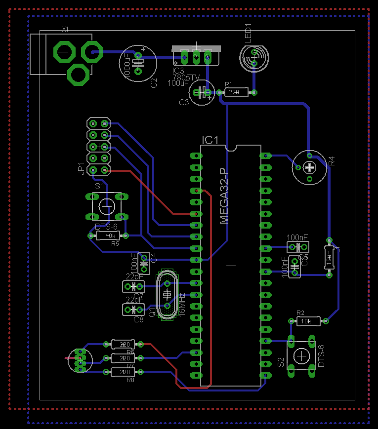

# Tristan Wąsik, EM - Projekt Technika Mikroprocesorowa
RGB Mixer 
# Opis działania projektu
Moim projektem jest Mixer RGB. Jego działanie opiera się na potencjometrze - nim użytkownik wybiera poziom jasności danego koloru. W celu zmiany koloru należy wcisnąć przycisk. Sercem projektu jest AtMega32A-PU 16Mhz. Zasilanie od programatora bądź złącza jack 2.1/5.5mm (5-12VDC). Sygnalizacja zasilania odbywa się poprzez diodę LED. Zastosowano 3 porty PWM (2 porty 8-bitowe oraz 1 port 10-bitowy). Kolejne porty to port ADC służący rejestrowaniu statusu potencjometra oraz port IO dla przycisku. 




```cpp
tu bedzie kod 
```